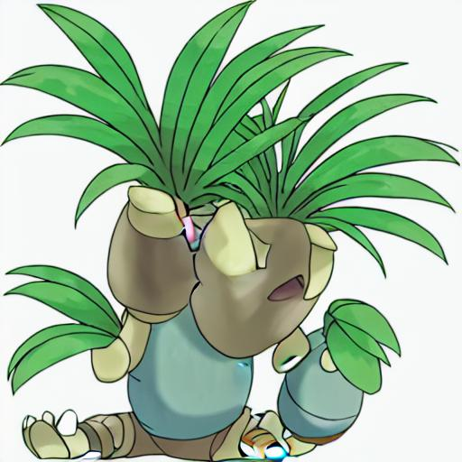
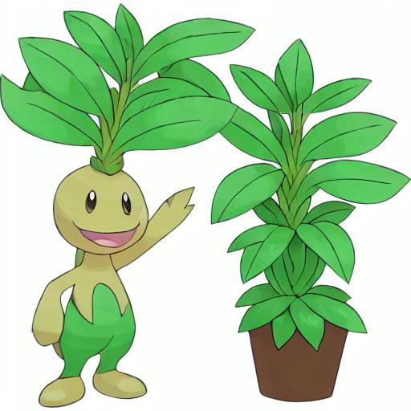
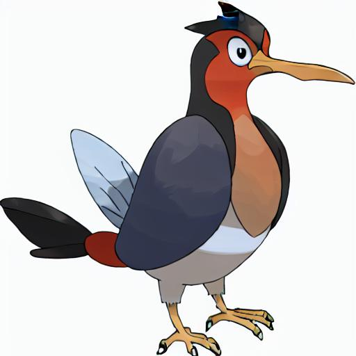
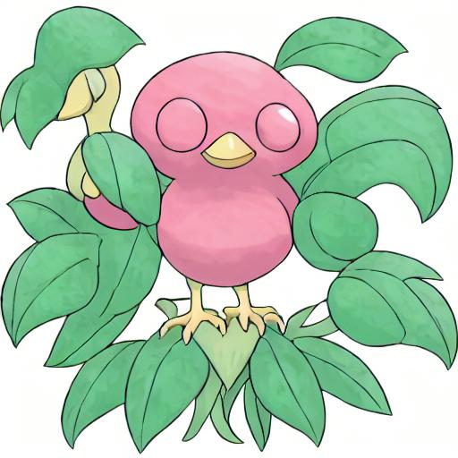
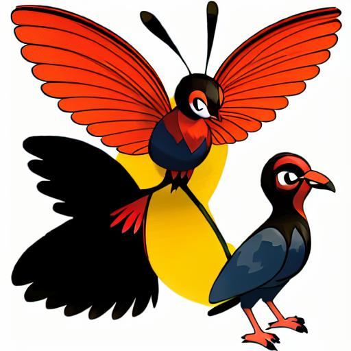
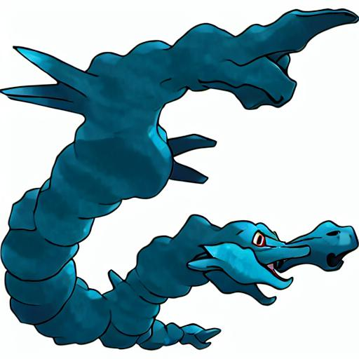
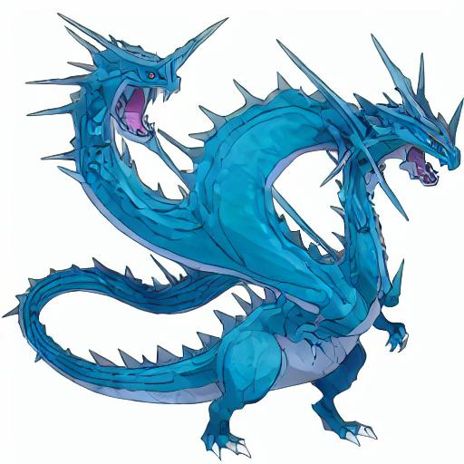
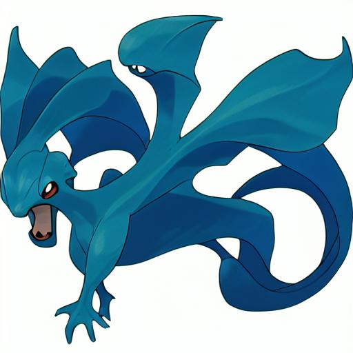

<!-- PROJECT LOGO -->
<br />
<p align="center">
  <h3 align="center">Stable-Diffusion-Pokemon</h3>

  <p align="center">
   		A demo of fine tune Stable Diffusion on Pokemon-Blip-Captions in English, Japanese and Chinese Corpus
    <br />
  </p>
</p>

### Brief introduction
[Stable Diffusion](https://stability.ai/blog/stable-diffusion-public-release) is a state of the art text-to-image model that generates images from text.<br/>
Nowadays, with the help of [diffusers](https://github.com/huggingface/diffusers), which provides pretrained diffusion models across multiple modalities, people can customize their own image generator conditional (based on prompt) or unconditional.<br/>
This project focus on run the [text to image example](https://github.com/huggingface/diffusers/tree/main/examples/text_to_image) diffusers provided based on [lambdalabs/pokemon-blip-captions](https://huggingface.co/datasets/lambdalabs/pokemon-blip-captions) and migrate this task to Japanese and Chinese domain
in both model and data dimensions. Compare the conclusions that may give a guideline about the fine tuning of Stable Diffusion in different languages.<br/>
All codes are edit versions of the official [train_text_to_image.py](https://github.com/huggingface/diffusers/blob/main/examples/text_to_image/train_text_to_image.py) that make it works in Japanese and Chinese Domain.
And provide three pretrained models in [English](https://huggingface.co/svjack/Stable-Diffusion-Pokemon-en) , [Japanese](https://huggingface.co/svjack/Stable-Diffusion-Pokemon-ja) and [Chinese](https://huggingface.co/svjack/Stable-Diffusion-Pokemon-zh).

### Installtion and Running
Running install.sh will install all dependencies and download all models needed.(make sure you have login your huggingface account and have your [token](https://huggingface.co/docs/hub/security-tokens))
After download, you can try [run_en_model.py](run_en_model.py), [run_ja_model.py](run_ja_model.py) and [run_zh_model.py](run_zh_model.py) by yourself.

### DataSet prepare
For fine tuning them in Japanese and Chinese domains. All we need is the [lambdalabs/pokemon-blip-captions](https://huggingface.co/datasets/lambdalabs/pokemon-blip-captions) in Japanese and Chinese. I have translated them with the help of [DeepL](https://www.deepl.com/translator) and upload them to huggingface dataset hub. Locate in [svjack/pokemon-blip-captions-en-ja](https://huggingface.co/datasets/svjack/pokemon-blip-captions-en-ja) and [svjack/pokemon-blip-captions-en-zh](https://huggingface.co/datasets/svjack/pokemon-blip-captions-en-zh).

### Fine tuning pretrained models
The English version located in [train_en_model.py](train_en_model.py) is only a simply copy of [train_text_to_image.py](https://github.com/huggingface/diffusers/blob/main/examples/text_to_image/train_text_to_image.py) change the code run by accelerate in script to notebook by function
```python
notebook_launcher
```

The Japanese version located in [train_ja_model.py](train_ja_model.py)
replaced the pretrained model by [rinnakk/japanese-stable-diffusion](https://github.com/rinnakk/japanese-stable-diffusion)<br/>

The Chinese version located in [train_zh_model.py](train_zh_model.py)
replaced the pretrained tokenizer and text_encoder by [IDEA-CCNL/Taiyi-CLIP-Roberta-102M-Chinese](https://huggingface.co/IDEA-CCNL/Taiyi-CLIP-Roberta-102M-Chinese) and use logit output from BertForTokenClassification with padding to the downstream network to replace CLIPTextModel.

For take a look at all outputs, i disable the safety_checker to let all outputs without covered in the inference steps.

### Generator Results comparison
<table><caption>Images</caption>
<thead>
<tr>
<th>Prompt</th>
<th colspan="1">English</th>
<th colspan="1">Japanese</th>
<th colspan="1">Chinese</th>
</tr>
</thead>
<tbody>
<tr>
<td>A cartoon character with a potted plant on his head<br/><br/>鉢植えの植物を頭に載せた漫画のキャラクター<br/><br/>一个头上戴着盆栽的卡通人物</td>
<td></td>
<td></td>
<td></td>
</tr>
<tr>
<td>cartoon bird<br/><br/>漫画の鳥<br/><br/>卡通鸟</td>
<td></td>
<td></td>
<td></td>
</tr>
</tbody>
<tfoot>
<tr>
<td>blue dragon illustration<br/><br/>ブルードラゴンのイラスト<br/><br/>蓝色的龙图</td>
<td></td>
<td></td>
<td></td>
</tr>
</tfoot>
</table>

### Discussion
The pretrained models in English, Japanese and Chinese are trained for 26000, 26000 and 20000 steps respectively. The Japanese outperform others and the Chinese version seems the third. The interpretation can be
[rinnakk/japanese-stable-diffusion](https://github.com/rinnakk/japanese-stable-diffusion) have many culture and features about Pokemon, [Stable Diffusion](https://stability.ai/blog/stable-diffusion-public-release) in English domain is finetuned favourable. [IDEA-CCNL/Taiyi-CLIP-Roberta-102M-Chinese](https://huggingface.co/IDEA-CCNL/Taiyi-CLIP-Roberta-102M-Chinese) in Chinese as the model card introduction is only a text feature finetuned version.

<!-- CONTACT -->
## Contact

<!--
Your Name - [@your_twitter](https://twitter.com/your_username) - email@example.com
-->
svjack - svjackbt@gmail.com - ehangzhou@outlook.com

<!--
Project Link: [https://github.com/your_username/repo_name](https://github.com/your_username/repo_name)
-->
Project Link:[https://github.com/svjack/Stable-Diffusion-Pokemon](https://github.com/svjack/Stable-Diffusion-Pokemon)


<!-- ACKNOWLEDGEMENTS -->
## Acknowledgements
<!--
* [GitHub Emoji Cheat Sheet](https://www.webpagefx.com/tools/emoji-cheat-sheet)
* [Img Shields](https://shields.io)
* [Choose an Open Source License](https://choosealicense.com)
* [GitHub Pages](https://pages.github.com)
* [Animate.css](https://daneden.github.io/animate.css)
* [Loaders.css](https://connoratherton.com/loaders)
* [Slick Carousel](https://kenwheeler.github.io/slick)
* [Smooth Scroll](https://github.com/cferdinandi/smooth-scroll)
* [Sticky Kit](http://leafo.net/sticky-kit)
* [JVectorMap](http://jvectormap.com)
* [Font Awesome](https://fontawesome.com)
-->
* [Stable Diffusion](https://stability.ai/blog/stable-diffusion-public-release)
* [diffusers](https://github.com/huggingface/diffusers)
* [DeepL](https://www.deepl.com/translator)
* [rinnakk/japanese-stable-diffusion](https://github.com/rinnakk/japanese-stable-diffusion)
* [IDEA-CCNL/Taiyi-CLIP-Roberta-102M-Chinese](https://huggingface.co/IDEA-CCNL/Taiyi-CLIP-Roberta-102M-Chinese)
* [svjack](https://huggingface.co/svjack)
